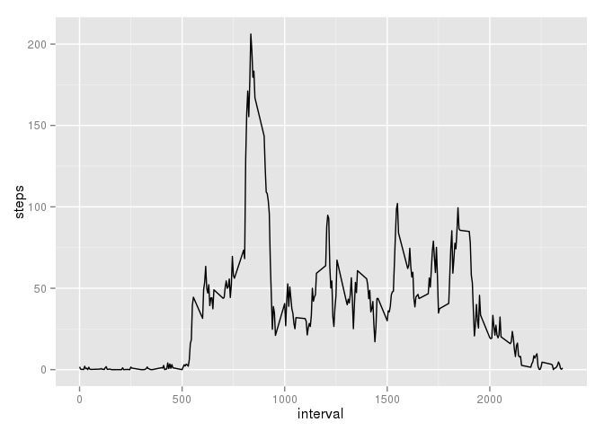

# Reproducible Research: Peer Assessment 1


## Load libraries and external scripts


```r
require(dplyr)
require(ggplot2)
source("FileDownload.R")
```


## Loading and Preprocessing Data

Verify that the data is present, and download and extract it if not.


```r
archive <- "activity.zip"
downloadURL <- "https://d396qusza40orc.cloudfront.net/repdata%2Fdata%2Factivity.zip"
fileList <- "activity.csv"

fileCheck(archive, downloadURL, fileList)
```

Load and preprocess the activity data.


```r
activity <- read.csv(fileList[1])

## Create summary for total daily steps
activity.daily <- summarise(group_by(activity, date), 
                            steps = sum(steps))

## Create summary for average over each 5 minute interval
activity.interval <- summarise(group_by(activity, interval), 
                               steps = mean(steps, na.rm = TRUE))
```

1. Create a histogram of the total number of steps taken each day.


```r
qplot(steps, data = activity.daily, geom = "histogram")
```

```
## stat_bin: binwidth defaulted to range/30. Use 'binwidth = x' to adjust this.
```

 

2. Calculate and report the mean and median total number of steps taken per day


```r
mean(activity.daily$steps, na.rm = TRUE)
```

```
## [1] 10766.19
```

```r
median(activity.daily$steps, na.rm = TRUE)
```

```
## [1] 10765
```

## What is the average daily activity pattern?

1. Make a time series plot (i.e. type = "l") of the 5-minute interval (x-axis) and the average number of steps taken, averaged across all days (y-axis)


```r
qplot(interval, steps, data = activity.interval, geom = "line")
```

 

2. Which 5-minute interval, on average across all the days in the dataset, contains the maximum number of steps?


```r
filter(activity.interval, steps == max(steps))
```

```
## Source: local data frame [1 x 2]
## 
##   interval    steps
## 1      835 206.1698
```

## Imputing missing values

1. Calculate and report the total number of missing values in the dataset (i.e. the total number of rows with NAs)


```r
sum(is.na(activity))
```

```
## [1] 2304
```

2. Devise a strategy for filling in all of the missing values in the dataset. The strategy does not need to be sophisticated. For example, you could use the mean/median for that day, or the mean for that 5-minute interval, etc.

Values are imputed for NAs by averaging a range of the three nearest intervals on both the preceding and subsequent days, as well as the same interval two days before and after.

3. Create a new dataset that is equal to the original dataset but with the missing data filled in.


```r
activity.imputed <- activity
for (i in 1:nrow(activity.imputed)) {
    ## number of intervals per day
    day = 288
    ## range for ± 1 interval
    i.range = -1:1
    
    if (is.na(activity.imputed[i,1])) {
        
        if (i <= 2 * day) {
        ## Evaluate observations that are too
        ## early for all preceding data to exist
            if (i <= day) {
                activity.imputed$steps[i] <- 
                    mean(activity$steps[c(i + day + i.range, 
                                          i + 2 * day)], 
                         na.rm = TRUE)
            } else {
                activity.imputed$steps[i] <- 
                    mean(activity$steps[c(i + day + i.range, 
                                          i - day + i.range,
                                          i + 2 * day)], 
                         na.rm = TRUE)
            }
        } else if (i >= nrow(activity.imputed) - 2 * day) {
        ## Evaluate observations that are too 
        ## late for all subsequent data to exist
            if (i >= nrow(activity.imputed) - day) {
                activity.imputed$steps[i] <- 
                    mean(activity$steps[c(i - day + i.range, 
                                          i - 2 * day)], 
                         na.rm = TRUE)
            } else {
                activity.imputed$steps[i] <- 
                    mean(activity$steps[c(i + day + i.range, 
                                          i - day + i.range,
                                          i - 2 * day)], 
                         na.rm = TRUE)
            }
        } else {
        ## The bulk of the cases fall here
            activity.imputed$steps[i] <- 
                mean(activity$steps[c(i + day + i.range,
                                      i - day + i.range,
                                      i + 2 * day,
                                      i - 2 * day)],
                     na.rm = TRUE)
        }
    }
}
## Create summary for total daily steps
activity.imputed.daily <- summarise(group_by(activity.imputed, date), 
                            steps = sum(steps))
```

4. Make a histogram of the total number of steps taken each day and Calculate and report the mean and median total number of steps taken per day. Do these values differ from the estimates from the first part of the assignment? What is the impact of imputing missing data on the estimates of the total daily number of steps?


```r
qplot(steps, data = activity.imputed.daily, geom = "histogram")
```

```
## stat_bin: binwidth defaulted to range/30. Use 'binwidth = x' to adjust this.
```

 

```r
mean(activity.imputed.daily$steps, na.rm = TRUE)
```

```
## [1] 10462.42
```

```r
median(activity.imputed.daily$steps, na.rm = TRUE)
```

```
## [1] 10571
```

Imputing missing data reduced the average and median number of steps per day by ~ 2-3%.

## Are there differences in activity patterns between weekdays and weekends?

1. Create a new factor variable in the dataset with two levels – “weekday” and “weekend” indicating whether a given date is a weekday or weekend day.


```r
activity.imputed$weekday <- factor(weekdays(as.POSIXct(activity.imputed$date)))
activity.imputed$weekend <- 
    factor(activity.imputed$weekday %in% c("Saturday", "Sunday"), 
           levels = c(FALSE,TRUE), labels = c("Weekday", "Weekend"))

activity.imputed.weekend <- 
    summarise(group_by(activity.imputed, weekend, interval), 
              steps = mean(steps))
```

2. Make a panel plot containing a time series plot (i.e. type = "l") of the 5-minute interval (x-axis) and the average number of steps taken, averaged across all weekday days or weekend days (y-axis).


```r
qplot(interval, steps, data = activity.imputed.weekend, geom = "line", facets = weekend ~ .)
```

 

